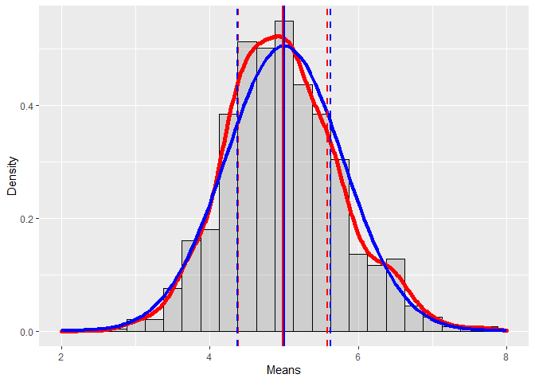
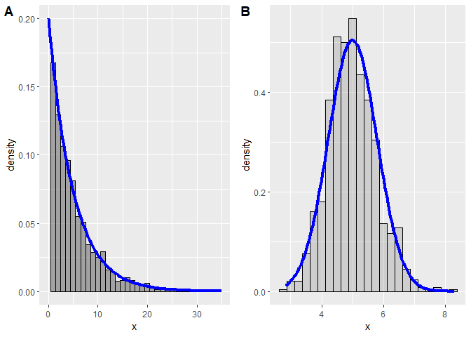

Overview
--------

In this project we investigate the exponential distribution and compare
it with the CLT. We test the distribution of averages of 40 exponentials
in a thousand simulations.

Simulation
----------

First we setup the environment an create the variables.

``` r
library(ggplot2)
lambda <- 0.2
mean <- 1/lambda
sd <- 1/lambda
n <- 40
sim <- 1000
```

With the environment ready, we generate a vector of averages of 40
exponentials:

``` r
set.seed(11) 
mns = NULL
for (i in 1 : 1000) mns = c(mns, mean(rexp(n, lambda)))
```

### 1. Sample mean and theoritcal mean of the distribution

``` r
sampleMean = mean(mns)
theoreticalMean = 1/lambda
```

    ## sampleMean: 4.987157 - theoreticalMean:  5

### 2. Standard Deviation and Variance

``` r
sampleSd = sd(mns)
theoreticalSd = (1/lambda)/sqrt(n)
```

    ## sampleSd: 0.7752021 - theoreticalSd:  0.7905694

``` r
sampleVar = var(mns)
theoreticalVar = theoreticalSd**2
```

    ## sampleVar: 0.6009383 - theoreticalVar:  0.625



In the figure above, we can see that the samples means distribution (red
lines) is very similar to the normal distribution (blue lines), they
both have similar mean (vertical lines) and variance (vertical dashed
lines).

Means distribution
------------------



A. **Distribution of random exponentials**, with a large number of
sample we can see that its histogram is similar to the theoretical
exponential density function.

B. **Distribution of averages of 40 exponentials**, with a large number
of simulations we can see that the distribution of the samples’ means
approaches a normal distribution.
